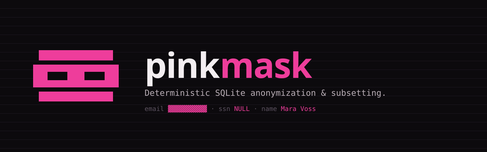

<p align="center">
  
</p>

<p align="center">
  <a href="https://dyne.github.io/pinkmask/">Documentation</a> ·
  <a href="https://dyne.github.io/pinkmask/config/">mask.yml reference</a> ·
  <a href="https://dyne.github.io/pinkmask/plugins/">Plugins</a>
</p>

# pinkmask

> Keep the shape, lose the secrets.

Deterministic SQLite anonymization and subsetting, inspired by Greenmask.

<p align="center">
  <a href="https://dyne.org" rel="noopener"></a>
</p>

## Install

### With mise

```bash
mise use -g github:dyne/pinkmask@latest
```

### With Go

```bash
go install github.com/dyne/pinkmask/cmd/pinkmask@latest
```

Prebuilt binaries for Linux, macOS, and Windows (amd64 and arm64) are attached to each [GitHub release](https://github.com/dyne/pinkmask/releases). Check the installed version with:

```bash
pinkmask version
```

## Usage

```bash
pinkmask copy --in input.sqlite --out output.sqlite --config examples/mask.yml --salt "abc" --seed 1
pinkmask sample --in input.sqlite --out output.sqlite --config examples/mask.yml --salt "abc" --seed 1
pinkmask inspect --in input.sqlite
pinkmask plan --in input.sqlite --config examples/mask.yml
pinkmask inspect --in input.sqlite --draft-config mask.draft.yml
```

### PocketBase instance-to-instance masking

Copy data from one PocketBase instance to another while applying the same
`mask.yml` transformers used by SQLite mode. The source is read-only. The
destination's missing non-system collections are created from the source
schema, record IDs are preserved for relations, and records are imported in
pages. System and read-only view collections are skipped. Auth collection
passwords are replaced with deterministic random values and file fields receive
deterministic placeholder files with fake names.

```bash
pinkmask pb \
  --source-url https://source.example \
  --source-email "$PB_SOURCE_EMAIL" \
  --source-password "$PB_SOURCE_PASSWORD" \
  --dest-url https://masked.example \
  --dest-email "$PB_DEST_EMAIL" \
  --dest-password "$PB_DEST_PASSWORD" \
  --config examples/mask.yml \
  --salt "abc" --seed 1
```

Credentials can be supplied through `PB_SOURCE_EMAIL`, `PB_SOURCE_PASSWORD`,
`PB_DEST_EMAIL`, and `PB_DEST_PASSWORD`; environment values take precedence
over matching flags. `include_tables` and `exclude_tables` apply to PocketBase
collections. Existing destination collections are not altered.

### PocketBase Docker fixture

The repository includes a seeded source fixture at
`testdata/pocketbase/source/pb_data`. It is mounted into the source container;
the destination uses the disposable named volume `pb_destination_data`.

Run the real two-instance transfer test:

```bash
docker compose --profile pb up --abort-on-container-exit \
  --exit-code-from pinkmask-pb \
  pb-source pb-destination pb-seed pinkmask-pb
```

The fixture seeder creates `customers`, `orders`, and `members` records and is
safe to rerun. Source superuser credentials are `admin@example.com` /
`pinkmask-admin-password`. The source is available at `http://localhost:8090`
and the destination at `http://localhost:8091` while the services are running.
Reset the disposable destination volume with:

```bash
docker compose --profile pb down -v
```

## Config reference

Config file is YAML. Example at `examples/mask.yml`.

Inspect draft config:
- `pinkmask inspect --in input.sqlite --draft-config mask.draft.yml`
- Uses PII name heuristics to emit a starter `mask.yml` with suggested transformers.

### Schema handling

Pinkmask copies SQLite schema objects in this order:
- Tables (from `sqlite_master`)
- Data rows
- Views, indexes, and triggers (optional via `--triggers on|off`)

Schema introspection uses:
- `PRAGMA table_info(table)` for columns and primary keys
- `PRAGMA foreign_key_list(table)` for FK graph ordering
- `sqlite_master` for SQL definitions of tables/views/indexes/triggers

By default, data copy is ordered by primary key (or `rowid`) and tables are ordered by foreign-key dependencies.

Top-level:
- `include_tables`: list of glob patterns to include
- `exclude_tables`: list of glob patterns to exclude
- `tables`: per-table column transforms
- `subset`: graph-aware subsetting configuration

Transformers:
- `HashSha256` (salted) with optional `maxlen`
- `HmacSha256` (salt as key) with optional `maxlen`
- `StableTokenize` (short base32 token) with optional `maxlen`
- `RegexReplace` (`pattern`, `replace`)
- `SetNull`
- `SetValue` (`value`)
- `FakerName`, `FakerEmail`, `FakerAddress`, `FakerPhone` (deterministic)
- `DateShift` (`params.max_days`)
- `Map` (`map` inline or `lookup_table`, `lookup_key`, `lookup_value`)

## Plugins (fast custom transformers)

Pinkmask supports optional Go plugins to keep the core binary lean while enabling high-performance, custom transforms and external dependencies. Plugins are loaded via `--plugin` and can register transformer names used in config.

### Writing a new transformer (plugin)

1) Create a Go module (or use a simple `main` package) that builds as a plugin.
2) Export a `Transformers` symbol: a map from transformer name to a function.
3) Use the transformer name in your YAML config (`type: YourName`).

Function signature:
- `func(any, map[string]any) (any, error)`
- `value` is the column value (possibly `nil`)
- `ctx` includes `table`, `pk`, `seed`, `salt`, and `config`

Example:

```go
package main

import "strings"

var Transformers = map[string]func(any, map[string]any) (any, error){
	"Lowercase": func(value any, ctx map[string]any) (any, error) {
		s, ok := value.(string)
		if !ok {
			return value, nil
		}
		return strings.ToLower(s), nil
	},
}
```

Build:

```bash
go build -buildmode=plugin -o lowercase.${GOOS}.${GOARCH}.so .
```

Config usage:

```yaml
tables:
  users:
    columns:
      email:
        type: Lowercase
```

Plugin contract (Linux/Darwin only):
- Build a Go plugin (`.so`) exporting a `Transformers` symbol:
  - `var Transformers = map[string]func(any, map[string]any) (any, error){ ... }`
- Each function receives the column value plus a context map with:
  - `table`, `pk`, `seed`, `salt`, and `config` (map of transformer config fields).

Example plugin skeleton:

```go
package main

var Transformers = map[string]func(any, map[string]any) (any, error){
	"MyFastMask": func(value any, ctx map[string]any) (any, error) {
		return value, nil
	},
}
```

Usage:

```bash
pinkmask copy --in input.sqlite --out output.sqlite --config examples/mask.yml --plugin ./myplugin.so
```

Example plugin source: `examples/plugins/rot13/main.go`
Build locally:

```bash
go build -buildmode=plugin -o rot13.so ./examples/plugins/rot13
```

Architecture-specific plugin naming:
- You can pass `--plugin ./rot13` and pinkmask will resolve:
  - `./rot13.<goos>.<goarch>.so`
  - `./rot13.<goarch>.so`
  - `./rot13.so` (if it already exists)

Directory loading:
- You can pass a directory to `--plugin` to load all compatible plugins inside it.
- Compatible filenames end with:
  - `.<goos>.<goarch>.so`
  - `.<goarch>.so`
  - `.so`

Subset example:

```yaml
subset:
  roots:
    - table: users
      where: "country = 'US'"
      limit: 50
```

### mask.yml schema

```yaml
include_tables:
  - "users*"
exclude_tables:
  - "audit_*"

tables:
  users:
    columns:
      email:
        type: HmacSha256
        maxlen: 24
      full_name:
        type: FakerName
      ssn:
        type: SetNull
      note:
        type: RegexReplace
        pattern: "[0-9]+"
        replace: "X"
      status:
        type: Map
        map:
          active: active
          inactive: inactive
  orders:
    columns:
      shipping_address:
        type: FakerAddress

subset:
  roots:
    - table: users
      where: "country = 'US'"
      limit: 50
```

#### Table config

- `tables.<table>.columns.<column>`: transformer config for a column
- `tables.<table>.where`: optional filter for root subsetting (used by `sample`)
- `tables.<table>.limit`: optional limit for root subsetting (used by `sample`)

#### Transformer config fields

- `type`: transformer name (built-in or plugin)
- `params`: map of transformer-specific params (e.g., `max_days`)
- `value`: static value for `SetValue`
- `pattern`, `replace`: for `RegexReplace`
- `locale`: reserved (currently `en` only)
- `maxlen`: optional max output length for hash/token transforms
- `map`: inline mapping dictionary for `Map`
- `lookup_table`, `lookup_key`, `lookup_value`: database lookup mapping for `Map`

#### Subset config

- `subset.roots`: list of roots to seed graph-aware subsetting
- `subset.roots[].table`: root table name
- `subset.roots[].where`: SQL WHERE clause for root selection
- `subset.roots[].limit`: limit on root selection

## Demo

```bash
go run examples/make_demo_db.go demo.sqlite
pinkmask copy --in demo.sqlite --out anon.sqlite --config examples/mask.yml --salt "abc" --seed 1
```

Docker demo:

```bash
docker compose --profile sqlite up
```

This produces `demo.sqlite`, `anon.sqlite`, and `anon_users.csv` in the repo.

## Limitations

- SQLite only; no external SQL parser.
- Triggers and views are copied as-is and may have side effects during import.
- For tables without primary keys, deterministic per-row values are derived from a row fingerprint.
- Subsetting expands selections via foreign keys; complex custom join logic is not supported.
- Built-in faker coverage is intentionally small; use plugins for large catalogs or specialized generators.

## Development

```bash
mise run test
mise run lint
mise run vuln
```

## Acknowledgments

- Idea and architecture: Puria Nafisi Azizi.
- AI-assisted development.
